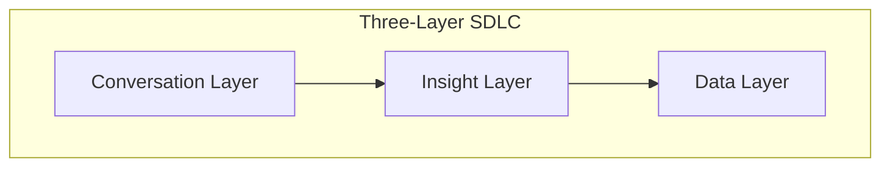
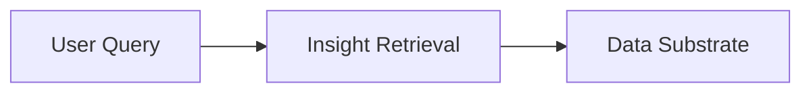
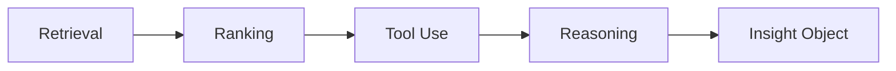
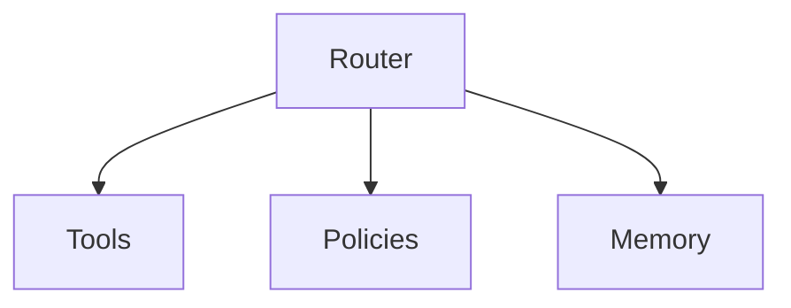
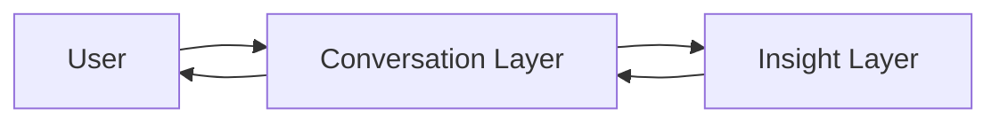
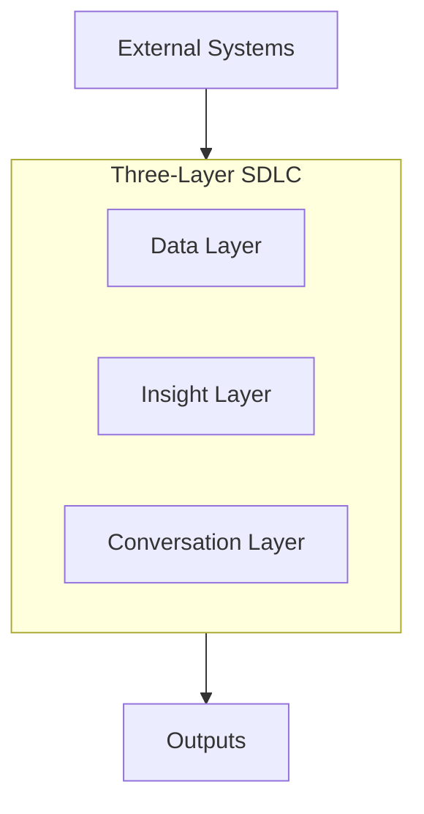

# Three-Layer Intelligence Stack

### A Practical SDLC Mental Model for Building Applied AI Systems

Created by: **Iqbal Yusuf (CAIO, KS Engineers PC)**
Version: **1.0**

---

## Overview

Modern AI systems often fail because teams think in terms of *models* (LLMs, prompts, fine-tuning). But real enterprise AI requires a broader, structured SDLC that aligns data, reasoning, and user experience.

This repository presents a clean, practical mental model:

# **DATA → INSIGHT → CONVERSATION**

A three-layer SDLC for designing, building, and delivering production-grade AI systems.
Used across real enterprise projects: CSSWEB Downloader, Resume Sorter AI, RFX Analyzer, Unanet P&L Insights, etc.

---

## 📊 Diagrams (Mermaid)

Below are six official diagrams illustrating the architecture.

### **Figure 1 — Three-Layer SDLC Overview**



### **Figure 2 — Data Flow Across Layers**



### **Figure 3 — Insight Engine Pipeline**



### **Figure 4 — Orchestration & Tool Routing**



### **Figure 5 — Conversation Feedback Loop**



### **Figure 6 — System Boundary Diagram**



---

## Layer 1 — DATA

**“What raw material do we have?”**

The substrate where all intelligence begins.

### Responsibilities

* Raw documents (PDF, CSV, email, drawings, resumes)
* SQL/NoSQL datasets
* Normalization, cleaning, canonical formats
* ETL / ELT pipelines
* Embeddings, vector stores (Chroma, PGVector, Pinecone)
* Metadata + tagging
* Data access controls
* Grounding datasets (enterprise truth)

### Outputs

* Unified Data Substrate
* Reliable, versioned, queryable data
* Ready for retrieval and reasoning

---

## Layer 2 — INSIGHT

**“What intelligent processing must happen?”**

Transforms raw data into validated, structured insight.

### Responsibilities

* RAG (retrieval, ranking, hybrid search)
* Reasoning chains
* Evaluators & comparators
* Tool router + function calling
* Memory + policy guardrails
* Deterministic prompting
* Domain logic & rule engines
* Observability (Promptfoo, DeepEval)

### Outputs

* Insights, comparisons, summaries
* Decision-ready structured data
* Machine-verifiable reasoning artifacts

---

## Layer 3 — CONVERSATION

**“How does the user experience the insight?”**

Turns intelligence into user-facing action.

### Responsibilities

* Chat interface
* APIs & webhooks
* Dashboards & executive summaries
* Reports (PDF/HTML/Email)
* Multi-step workflows
* Voice & mobile experiences
* Next-action recommendations

### Outputs

* Actionable UX
* Explainable outputs
* Continuous feedback loop with Layer 2

---

## Why This Model Works

1. Simple enough for executives
2. Strong enough for engineering teams
3. Clarifies AI SDLC in a way industry hasn’t
4. Ensures end-to-end traceability
5. Enables parallel team execution
6. Forms core of future **CAIO OS**

---

## Architecture Diagram (ASCII Reference)

```
┌──────────────────────────────────┐
│          LAYER 3:                │
│        CONVERSATION              │
└──────────────────────────────────┘
                ▲
                │
┌──────────────────────────────────┐
│          LAYER 2:                │
│           INSIGHT                │
└──────────────────────────────────┘
                ▲
                │
┌──────────────────────────────────┐
│          LAYER 1:                │
│             DATA                 │
└──────────────────────────────────┘
```

---

## Use Cases

* NYSDOT CSSWEB Downloader
* Resume Sorter / Talent Finder
* Unanet P&L Insights
* RFX Analyzer
* KSE On-Prem Chatbot Assistants

---

## Folder Structure

```
/three-layer-intelligence-stack
│
├── /layer1-data/
├── /layer2-insight/
├── /layer3-conversation/
│
├── README.md
└── diagrams/
```

---

## How to Use

* Start every system with **Data → Insight → Conversation**
* Assign teams by layer (Data / Insight / UX)
* Treat the model as a complete SDLC
* Deliver insight, not just model output

---

## License

MIT License

---

## Author

**Iqbal Yusuf**
NYC / NJ
