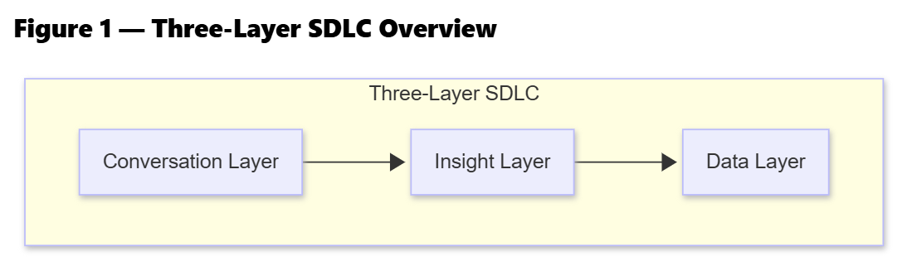
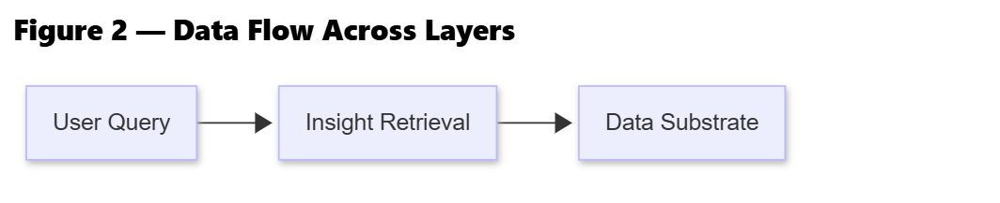
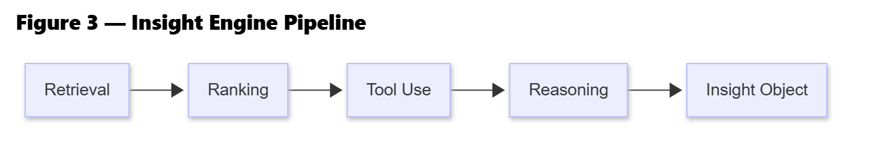
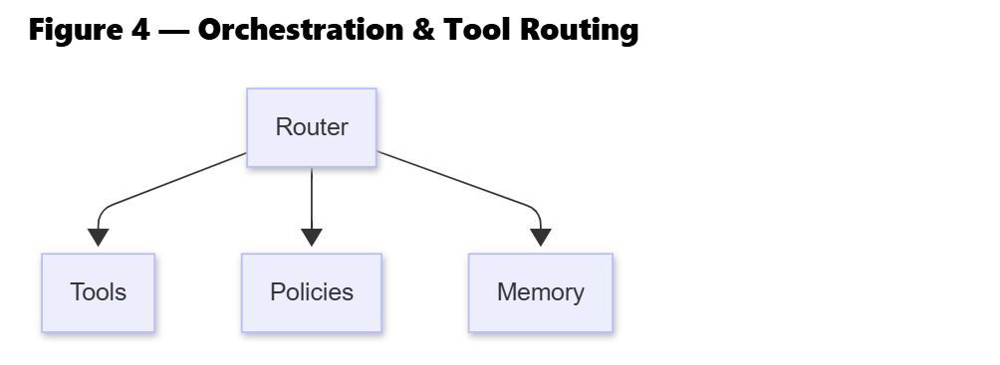
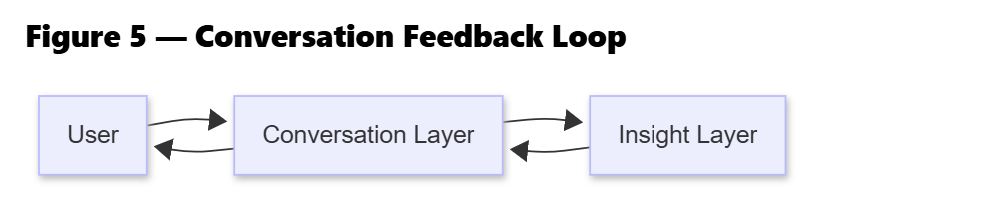
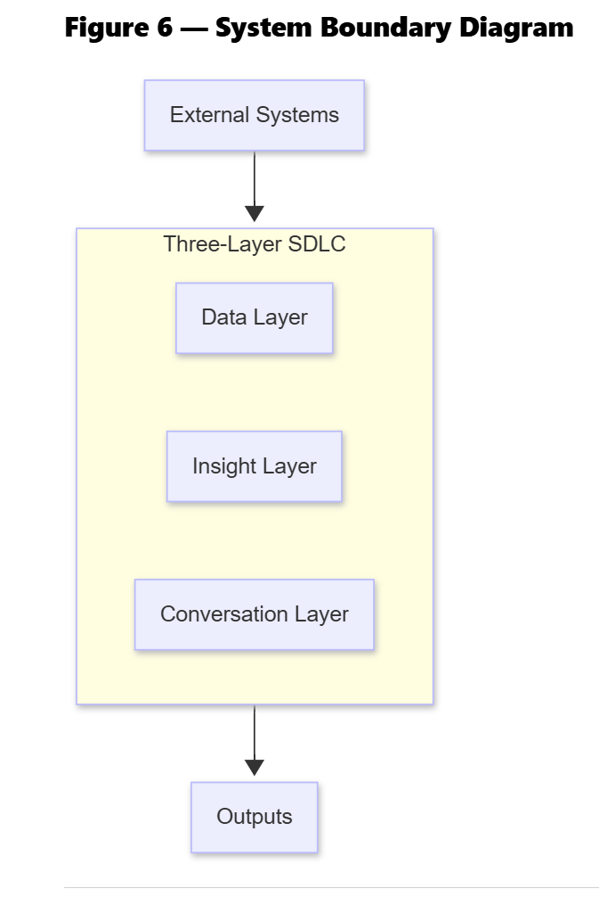

# **Provisional Patent Application (Draft)**

## **Title**

**SYSTEM AND METHOD FOR A THREE-LAYER APPLIED ARTIFICIAL INTELLIGENCE SOFTWARE DEVELOPMENT LIFECYCLE**

## **Inventor**

**Iqbal Yusuf**
NYC / NJ

---

# **ABSTRACT**

A unified software development lifecycle (SDLC) for applied artificial intelligence systems is disclosed. The SDLC comprises three structured layers: a **Data Layer** for preparing and transforming enterprise data; an **Insight Layer** for orchestrated retrieval, reasoning, tool execution, and generation of structured insights; and a **Conversation Layer** for delivering insights through conversational or multi-modal interfaces. This invention standardizes the design, construction, and deployment of enterprise AI systems by integrating data engineering, AI reasoning mechanisms, and user-interaction patterns into a single architectural lifecycle.

---

# **FIELD OF THE INVENTION**

The present invention relates to artificial intelligence systems and enterprise software architecture. More specifically, it concerns a standardized, layered SDLC for applied AI workflows involving data processing, reasoning/orchestration, and multi-modal user interaction.

---

# **BACKGROUND OF THE INVENTION**

AI engineering is fragmented. Traditional MLOps frameworks focus on dataset preparation and model deployment. Retrieval-Augmented Generation (RAG) pipelines emphasize retrieval and embedding workflows. Chatbot frameworks address dialogue management. Agent-based frameworks address tool invocation. However, **no unified SDLC exists** that combines these components into a reproducible, multi-layer lifecycle for enterprise AI.

Enterprises face recurring issues:

* Lack of boundaries between data preparation and reasoning
* Poorly defined orchestration responsibilities
* No standardized method for multi-modal user delivery
* Fragmented tool-use, memory, and policy layers
* Difficulty reproducing insights consistently across teams

This invention addresses these gaps.

---

# **SUMMARY OF THE INVENTION**

The invention introduces a reusable, three-layer SDLC for applied AI:

1. **Data Layer (Data Substrate)** – Handles ingestion, normalization, vectorization, metadata, and governance.
2. **Insight Layer (Insight Engine)** – Performs retrieval, ranking, tool-routing, reasoning, memory management, and generation of a structured Insight Object.
3. **Conversation Layer (Experience Layer)** – Manages chat interfaces, dashboards, APIs, reporting, and human-in-the-loop feedback loops.

Each layer has clearly defined responsibilities, interfaces, and outputs. The architecture resolves the fragmentation found in existing AI development approaches.

---

# **DETAILED DESCRIPTION OF THE INVENTION**

## **1. Data Layer (Data Substrate)**

This layer processes raw enterprise inputs into structured, retrievable formats.

### Responsibilities

* Data ingestion (PDF, CSV, SQL, NoSQL, emails, logs)
* Normalization & canonicalization
* Chunking & embedding vectorization
* Metadata extraction
* Governance, lineage, and access control
* Indexing for semantic retrieval

### Output

A unified **Data Substrate** suitable for search and reasoning.

### **Figure Placeholder (Insert Diagram Link Here)**

**FIGURE 1 – Data Layer Overview

**

---

## **2. Insight Layer (Insight Engine)**

A novel SDLC layer responsible for producing structured insight.

### Responsibilities

* Vector retrieval & hybrid search
* Ranking & relevancy scoring
* Reasoning & chain-of-thought logic
* Tool routing & external function execution
* Memory (short-term, long-term, episodic)
* Policy enforcement & guardrails
* Insight Object construction

### Output

A structured **Insight Object** containing:

* Evidence
* Reasoning steps
* Tool outputs
* Confidence indicators
* Recommended actions

### **Figure Placeholder (Insert Diagram Link Here)**

**FIGURE 2 – Insight Layer Pipeline

**

---

## **3. Conversation Layer (Experience Layer)**

The user-facing delivery layer of the lifecycle.

### Responsibilities

* Chat interfaces (LLM conversations)
* APIs, webhooks, server responses
* Reports (PDF, HTML, email)
* Visualization dashboards
* Workflow guidance & prompting
* Human-in-the-loop validation

### Output

A final **User Interaction Artifact**:

* Answer
* Summary
* Report
* Dashboard
* Action recommendation
* Multi-step workflow

### **Figure Placeholder (Insert Diagram Link Here)**

**FIGURE 3 – Conversation Layer Flow

**

---

# **CLAIMS**

### **Claim 1**

A software development lifecycle comprising a Data Layer, an Insight Layer, and a Conversation Layer; wherein:

* the Data Layer transforms raw enterprise data into a structured and retrievable substrate;
* the Insight Layer retrieves said data and performs reasoning, tool execution, and orchestration to generate structured insights; and
* the Conversation Layer delivers said insights to users through conversational or multi-modal interfaces.

### **Claim 2**

The system of Claim 1 wherein the Insight Layer generates an Insight Object containing evidence, reasoning, tool outputs, and confidence indicators.

### **Claim 3**

The system of Claim 1 wherein the Conversation Layer includes a feedback mechanism that refines or regenerates insights based on user interaction.

### **Claim 4**

The system of Claim 1 wherein the Data Layer includes chunking, embedding, metadata extraction, and governance workflows.

### **Claim 5**

The system of Claim 1 implemented as a standardized SDLC applicable across enterprise AI architectures.

---

# **DESCRIPTION OF FIGURES**

### **FIGURE 1 – Data Layer Overview**

*Placeholder: Insert diagram link*

### **FIGURE 2 – Insight Layer Pipeline**

*Placeholder: Insert diagram link*

### **FIGURE 3 – Conversation Layer Flow**

*Placeholder: Insert diagram link*

### **FIGURE 4 – Orchestration & Tool Routing

**
*Placeholder: Insert diagram link*

### **FIGURE 5 – Conversation Feedback Loop

**
*Placeholder: Insert diagram link*

### **FIGURE 6 – System Boundary Diagram

**
*Placeholder: Insert diagram link*

---

# **CONCLUSION**

This provisional application discloses a new, unified SDLC for applied artificial intelligence, enabling enterprise teams to design, build, and deliver consistent AI systems that integrate data management, reasoning orchestration, and user interaction workflows in a structured manner.

---

# **END OF DOCUMENT**
